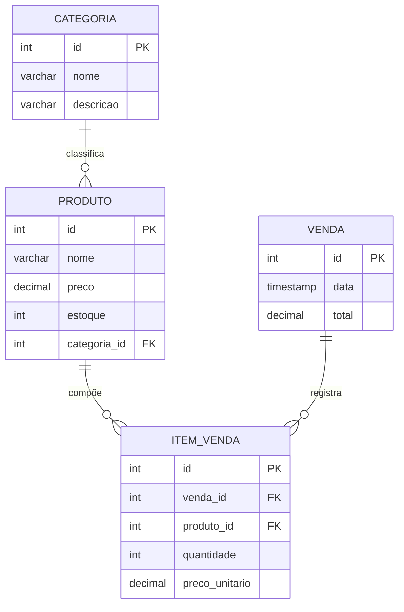

# Manual Técnico e de Produto: NTPB Dados 🛡️
**Versão:** 1.0.0 | **Data:** 02 de Junho de 2026  
**Status:** Fase 1 (Protótipo Funcional & Estrutura de Engenharia)

---

## 📑 Sumário
1.  [Visão Executiva](#1-visão-executiva)
2.  [Engenharia de Requisitos](#2-engenharia-de-requisitos)
    *   2.1 [Requisitos Funcionais (RF)](#21-requisitos-funcionais-rf)
    *   2.2 [Requisitos Não-Funcionais (RNF)](#22-requisitos-não-funcionais-rnf)
3.  [Arquitetura de Dados](#3-arquitetura-de-dados)
    *   3.1 [Diagrama de Entidade-Relacionamento (MER)](#31-diagrama-de-entidade-relacionamento-mer)
    *   3.2 [Dicionário de Dados](#32-dicionário-de-dados-principais-atributos)
4.  [Design System & UX](#4-design-system--ux)
5.  [Especificação da API](#5-especificação-da-api-endpoints-previstos)
6.  [Metodologia de Desenvolvimento](#6-metodologia-de-desenvolvimento)
7.  [Status de Implementação (Fase 1)](#7-status-de-implementação-fase-1)
8.  [Instruções de Execução](#8-instruções-de-execução)

---

## 1. Visão Executiva
O **NTPB Dados** é uma solução de Business Intelligence (BI) e Gestão Transacional desenvolvida para e-commerce. O objetivo é centralizar a gestão de inventário e oferecer visualizações analíticas em tempo real para otimizar a tomada de decisão gerencial.

## 2. Engenharia de Requisitos

### 2.1 Requisitos Funcionais (RF)
*   **RF-001:** O sistema deve permitir o cadastro de categorias e produtos.
*   **RF-002:** O sistema deve registrar vendas vinculando produtos e quantidades.
*   **RF-003:** O sistema deve **abater o estoque** automaticamente após a confirmação de uma venda.
*   **RF-004:** O sistema deve apresentar gráficos de desempenho (Barras e Linhas) baseados no histórico de vendas.
*   **RF-005:** O sistema deve impedir vendas de itens com estoque insuficiente.

### 2.2 Requisitos Não-Funcionais (RNF)
*   **RNF-001:** A interface deve ser responsiva e seguir padrões de design moderno (SaaS Style).
*   **RNF-002:** O sistema deve ser desenvolvido em **TypeScript** para garantir integridade de dados via tipagem estática.
*   **RNF-003:** O tempo de resposta para atualização de gráficos após uma venda não deve exceder 200ms (reatividade).
*   **RNF-004:** O banco de dados deve garantir integridade referencial via chaves estrangeiras (PostgreSQL).

## 3. Arquitetura de Dados

### 3.1 Diagrama de Entidade-Relacionamento (MER)


### 3.2 Dicionário de Dados (Principais Atributos)
| Tabela | Atributo | Tipo | Descrição |
| :--- | :--- | :--- | :--- |
| PRODUTO | preco | DECIMAL(10,2) | Valor unitário do produto com duas casas decimais. |
| PRODUTO | estoque | INTEGER | Quantidade disponível (mínimo 0). |
| VENDA | data | TIMESTAMP | Registro de data e hora UTC da transação. |
| ITEM_VENDA | preco_unitario | DECIMAL(10,2) | Preço praticado no momento da venda (histórico). |

## 4. Design System & UX
*   **Cores:** Primária `#6366f1` (Indigo), Fundo `#f8fafc` (Slate 50).
*   **Tipografia:** Inter / System UI (Foco em legibilidade de dados numéricos).
*   **Componentes:** Uso de `Lucide-React` para iconografia semântica e `Chart.js` para visualização de dados.

## 5. Especificação da API (Endpoints Previstos)

| Método | Endpoint | Descrição |
| :--- | :--- | :--- |
| `GET` | `/api/products` | Retorna lista de todos os produtos e níveis de estoque. |
| `POST` | `/api/products` | Cria um novo registro de produto. |
| `POST` | `/api/sales` | Processa uma venda e executa o trigger de baixa de estoque. |
| `GET` | `/api/dashboard/stats` | Retorna agregados (Receita, Vendas, Ticket Médio). |

## 6. Metodologia de Desenvolvimento
O projeto utiliza a metodologia **Conventional Commits** para versionamento:
*   `feat`: Novas funcionalidades (ex: lógica de abatimento de estoque).
*   `fix`: Correção de falhas (ex: ajuste no cálculo do ticket médio).
*   `docs`: Atualização de manuais e documentação técnica.

## 7. Status de Implementação (Fase 1)
*   [x] Estrutura Full-stack inicializada (Node.js/React).
*   [x] Interface de alta fidelidade implementada.
*   [x] Lógica de negócio transacional (Venda -> Baixa de Estoque) funcional.
*   [x] Modelagem de banco de dados concluída.

## 8. Instruções de Execução
Para rodar o protótipo funcional, utilize os seguintes comandos nos respectivos diretórios:

### Backend
```bash
cd backend
npm run dev
```

### Frontend
```bash
cd frontend
npm run dev
```

---
**Homologado por:** Equipe NTPB (Wanderson, Gabriel, Rafael, Elias, Alessandra)  
**IFTO - 2026**
