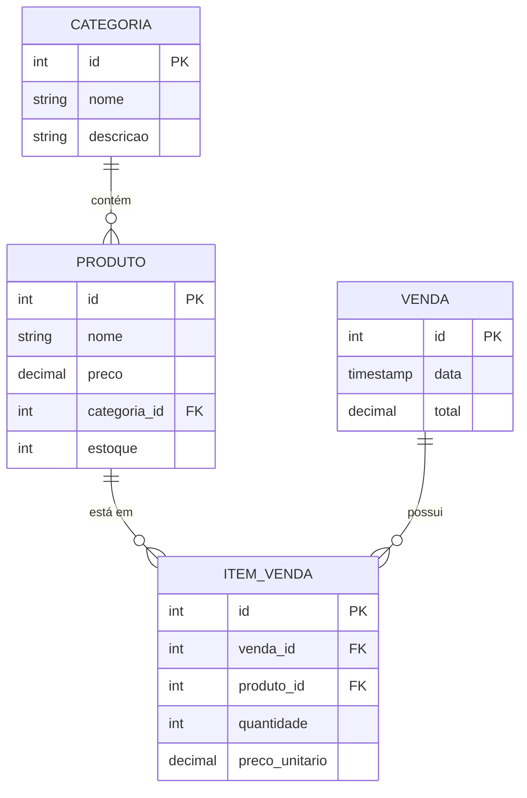

# Documentação Técnica - NTPBDados

## 1. Modelo de Dados (MER - Conceitual)

### Entidades Principais:

1.  **Categoria**
    *   `id` (PK): Inteiro, Serial
    *   `nome`: String, Único
    *   `descricao`: String

2.  **Produto**
    *   `id` (PK): Inteiro, Serial
    *   `nome`: String
    *   `preco`: Decimal
    *   `categoria_id` (FK): Referência a Categoria
    *   `estoque`: Inteiro

3.  **Venda**
    *   `id` (PK): Inteiro, Serial
    *   `data`: Timestamp (default NOW)
    *   `total`: Decimal

4.  **Item_Venda** (Tabela de Relacionamento N:N entre Venda e Produto)
    *   `id` (PK): Inteiro, Serial
    *   `venda_id` (FK): Referência a Venda
    *   `produto_id` (FK): Referência a Produto
    *   `quantidade`: Inteiro
    *   `preco_unitario`: Decimal (valor no momento da venda)

## 2. Diagrama de Relacionamento (Mermaid)

## 3. Endpoints Previstos (Backend)

*   `GET /api/dashboard/stats`: Retorna totais de vendas, ticket médio e produtos em destaque.
*   `GET /api/dashboard/vendas-por-periodo`: Dados para gráfico de linha (evolução temporal).
*   `GET /api/dashboard/vendas-por-categoria`: Dados para gráfico de pizza/rosca.
*   `GET /api/produtos`: Listagem e filtros.
*   `POST /api/vendas`: Registro de nova venda.
